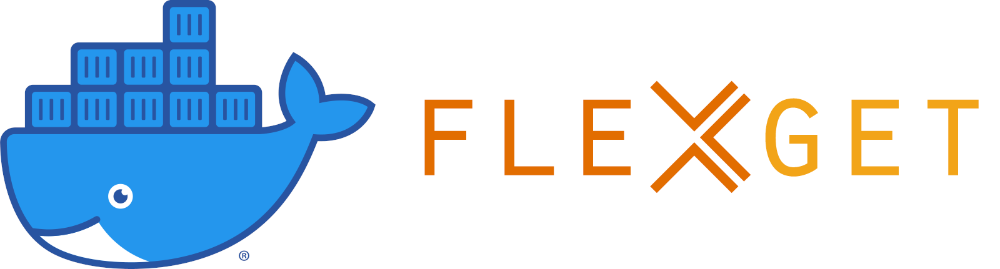

docker-flexget
==============

    

    
    
    
     
    
    
    
    

    Docker image for <a href="https://flexget.com">FlexGet</a> client.

---

Running the Container
---------------------

In order to persist configuration data through container upgrades you should create a named data
volume where your config data will be stored. This is not required but is _highly_ recommended.

    docker volume create --name flexget-data

Next you _must_ create your [config file](http://flexget.com/wiki/Configuration):

    docker run -it --rm -v flexget-data:/etc/flexget phlak/flexget vi /etc/flexget/config.yml

    
Example config

    tasks:
    test task:
        rss: http://mysite.com/myfeed.rss
        series:
        - My Favorite Show
        - Another Good Show:
            quality: 720p

After the config file has been created run the client container with the named data volume:

    docker run -d -v flexget-data:/etc/flexget --name flexget-client phlak/flexget

#### Optional 'docker run' Arguments

<dl>
    <dt><code>-e TZ=America/Phoenix</code></dt>
    <dd>Set the timezone for your server. You can find your timezone in this <a href="https://goo.gl/uy1J6q">list of timezones</a>. Use the (case sensitive) value from the <code>TZ</code> column. If left unset, timezone will be UTC.</dd>
</dl>

<dl>
    <dt><code>--restart unless-stopped</code></dt>
    <dd>Always restart the container regardless of the exit status, but do not start it on daemon startup if the container has been put to a stopped state before. See the Docker <a href="https://goo.gl/Y0dlDH">restart policies</a> for additional details.</dd>
</dl>

Configuring FlexGet
-------------------

Once you have a running client container, you can edit the FlexGet config with:

    docker exec -it flexget-client vi /etc/flexget/config.yml

After saving changes, restart your container with `docker restart flexget-client`

Troubleshooting
---------------

For general help and support join our [Spectrum Community](https://spectrum.chat/phlaknet) or reach out on [Twitter](https://twitter.com/PHLAK).

Please report bugs to the [GitHub Issue Tracker](https://github.com/PHLAK/docker-flexget/issues).

Copyright
---------

This project is licensed under the [MIT License](https://github.com/PHLAK/docker-flexget/blob/master/LICENSE).
